# PhiWave Project Progress Flowchart

**Date:** October 30, 2025
**Visual Timeline:** Project evolution from basic GUI to premium assets

---

## Full Project Flowchart (Mermaid Syntax)

```mermaid
flowchart TD
    Start([PhiWave Project Start]) --> Phase0[Phase 0: Basic Foundation]

    Phase0 --> Audio[Audio Engine Complete<br/>✓ Binaural beats<br/>✓ Isochronic tones<br/>✓ Fibonacci presets]
    Phase0 --> BasicGUI[Basic Tkinter GUI<br/>✓ tk.Button widgets<br/>✓ tk.Scale sliders<br/>✓ Preset dropdown]

    Audio --> UserVision[User Creates Premium Vision]
    BasicGUI --> UserVision

    UserVision --> Mockups[User Creates Mockup Designs<br/>📄 playmock.svg<br/>📄 stopmock.svg<br/>📄 exportmock.svg<br/><br/>Premium black pill buttons<br/>Layered gradients + shadows<br/>Metallic gold icons<br/>4 states each]

    Mockups --> Delegation{Delegate to<br/>IDE Claude}

    Delegation --> IDEC_Work[IDEC Work Session<br/>Oct 29-30]

    IDEC_Work --> Task1[TASK-001: Golden Sliders<br/>✓ Frequency-color mapping<br/>✓ Slider text colors change<br/>Commit: 730be54]

    IDEC_Work --> Task2[Modern Assets Infrastructure<br/>✓ Asset loading system<br/>✓ Fallback mechanisms<br/>✓ PNG export helpers<br/>Commit: 3620533]

    IDEC_Work --> Task3[TASK-003: Status LED Backend<br/>✓ LED class created<br/>✓ State management<br/>Commit: fd35154]

    Task1 --> Complete1[Polish Phase Tier 1<br/>Marked COMPLETE<br/>5/5 tasks done]
    Task2 --> Complete1
    Task3 --> Complete1

    Complete1 --> UserCheck{User Reviews<br/>Visual Result}

    UserCheck -->|"GUI barely changed!"| Problem[❌ PROBLEM DISCOVERED<br/><br/>• Premium mockups NOT used<br/>• GUI still basic Tkinter<br/>• No black pill buttons<br/>• No layered gradients<br/>• No gloss effects<br/>• Infrastructure built,<br/>  but no visual transform]

    Problem --> UserRequest[User Request:<br/>"Let's create each asset<br/>individually ourselves"]

    UserRequest --> TERMC_Session[TERMC Session Begins<br/>Oct 30, 2025]

    TERMC_Session --> Doc1[Create PROJECT_SUMMARY.md<br/>347 lines<br/>Complete context & status]
    TERMC_Session --> Doc2[Create AGENT_TASKS.md<br/>1200+ lines<br/>16 tasks, 36.5 hours scoped]
    TERMC_Session --> Doc3[Create IDE_CLAUDE_ACTION_PLAN.md<br/>574 lines<br/>6 focused sessions]

    Doc1 --> Monitor[Create agent_hub_monitor.py<br/>318 lines<br/>Background error scanner<br/>Running as process 6322ac]
    Doc2 --> Monitor
    Doc3 --> Monitor

    Monitor --> Assessment[Assess IDEC's Work<br/><br/>Discovery: Infrastructure complete<br/>but mockup designs unused]

    Assessment --> Extract[Asset Extraction Phase]

    Extract --> Play[Extract Play Button<br/>✓ play_button_default.svg<br/>✓ play_button_hover.svg<br/>✓ play_button_pressed.svg<br/>✓ play_button_disabled.svg]

    Extract --> Stop[Extract Stop Button<br/>✓ stop_button_default.svg<br/>✓ stop_button_hover.svg<br/>✓ stop_button_pressed.svg<br/>✓ stop_button_disabled.svg]

    Extract --> Export[Extract Export Button<br/>✓ export_button_default.svg<br/>✓ export_button_hover.svg<br/>✓ export_button_pressed.svg<br/>✓ export_button_disabled.svg]

    Play --> Preserve[Design Elements Preserved<br/>✓ Layered gradients<br/>✓ Inner instep shadows<br/>✓ Metallic gold icons<br/>✓ Gloss overlays<br/>✓ Interactive states]
    Stop --> Preserve
    Export --> Preserve

    Preserve --> ExtractDoc[Create ASSET_EXTRACTION_COMPLETE.md<br/>Integration guide<br/>Tkinter examples<br/>Testing checklist]

    ExtractDoc --> Hub[Post to Agent Hub<br/>Message #51<br/>Notify IDEC assets ready]

    Hub --> Current[CURRENT STATE<br/>✓ 12 premium SVG buttons<br/>✓ Complete documentation<br/>✓ Integration examples<br/>✓ Monitoring system active]

    Current --> Next{Next Steps}

    Next --> IDEC_Next[IDEC: Integrate Buttons<br/>Replace tk.Button with<br/>premium SVG buttons<br/>Implement state management]

    Next --> IDEC_UI[IDEC: Additional UI Elements<br/>• Golden sliders styling<br/>• Panel backgrounds<br/>• Progress bars<br/>• Status LED visuals]

    Next --> Junie_Test[Junie: QA Testing<br/>• Visual inspection<br/>• State transitions<br/>• Hover effects<br/>• User interactions]

    IDEC_Next --> Future[Future: Premium GUI Complete<br/>Black pill buttons ✨<br/>Golden ratio design ✨<br/>High-end AV aesthetic ✨]
    IDEC_UI --> Future
    Junie_Test --> Future

    Future --> End([PhiWave: Premium Audio<br/>Meditation Experience])

    style Start fill:#4A0E4E,stroke:#FFB300,color:#fff
    style Problem fill:#F44336,stroke:#C62828,color:#fff
    style Current fill:#43A047,stroke:#2E7D32,color:#fff
    style Future fill:#FFB300,stroke:#FF6F00,color:#000
    style End fill:#00ACC1,stroke:#00897B,color:#fff

    style Play fill:#E8F5E9,stroke:#43A047
    style Stop fill:#E8F5E9,stroke:#43A047
    style Export fill:#E8F5E9,stroke:#43A047
    style Preserve fill:#FFF9C4,stroke:#FFB300
```

---

## Timeline View (Sequential)

```mermaid
gantt
    title PhiWave Development Timeline
    dateFormat YYYY-MM-DD
    section Foundation
    Audio Engine Complete           :done, audio, 2025-10-01, 7d
    Basic Tkinter GUI               :done, gui, 2025-10-08, 5d

    section User Vision
    Premium Mockup Designs          :done, mock, 2025-10-15, 3d
    playmock.svg created            :done, 2025-10-15, 1d
    stopmock.svg created            :done, 2025-10-16, 1d
    exportmock.svg created          :done, 2025-10-17, 1d

    section IDEC Work
    TASK-001: Golden Sliders        :done, task1, 2025-10-29, 1d
    Modern Assets Infrastructure    :done, infra, 2025-10-29, 1d
    TASK-003: Status LED Backend    :done, task3, 2025-10-30, 1d
    Polish Phase Tier 1 Complete    :milestone, 2025-10-30, 0d

    section Problem Discovery
    User Review - Issue Found       :crit, review, 2025-10-30, 1h

    section TERMC Work
    Documentation Creation          :active, docs, 2025-10-30, 2h
    Agent Hub Monitor Setup         :active, monitor, 2025-10-30, 1h
    Asset Extraction (12 files)     :active, extract, 2025-10-30, 2h
    Integration Guide               :active, guide, 2025-10-30, 1h

    section Next Phase
    IDEC: Button Integration        :idec, 2025-10-31, 3d
    IDEC: UI Elements               :idec2, 2025-11-03, 4d
    Junie: QA Testing               :junie, 2025-11-07, 2d
    Premium GUI Complete            :milestone, 2025-11-09, 0d
```

---

## Decision Tree (Problem Discovery & Solution)

```mermaid
flowchart LR
    Review[User Reviews GUI] --> Check{Mockups<br/>Used?}

    Check -->|YES| Good[✓ Premium Look<br/>Visual Transform<br/>Complete]

    Check -->|NO| Bad[❌ Only Infrastructure<br/>Still Basic Tkinter<br/>No Visual Change]

    Bad --> Options{Solution<br/>Options}

    Options --> A[A: Wait for IDEC<br/>to notice & fix]
    Options --> B[B: Tell IDEC<br/>what's missing]
    Options --> C[C: Extract assets<br/>ourselves]

    A --> Slow[❌ Slow<br/>No timeline]
    B --> Unclear[❌ Ambiguous<br/>May misunderstand]
    C --> Fast[✓ Clear deliverable<br/>Ready to integrate]

    Fast --> Extract[TERMC Extracts<br/>12 Button SVGs]
    Extract --> Document[Create Integration<br/>Guide + Examples]
    Document --> Ready[✓ Ready for<br/>Immediate Use]

    style Bad fill:#FFCDD2,stroke:#F44336
    style Good fill:#C8E6C9,stroke:#43A047
    style Fast fill:#C8E6C9,stroke:#43A047
    style Ready fill:#FFE082,stroke:#FFB300
    style Slow fill:#FFCDD2,stroke:#F44336
    style Unclear fill:#FFCDD2,stroke:#F44336
```



---

## Data Flow (Asset Pipeline)

```mermaid
flowchart TD
    User[User Creates<br/>Premium Mockups] --> Mock1[playmock.svg<br/>4 button states<br/>in one file]
    User --> Mock2[stopmock.svg<br/>4 button states<br/>in one file]
    User --> Mock3[exportmock.svg<br/>4 button states<br/>in one file]

    Mock1 --> Extract[TERMC Extraction<br/>Process]
    Mock2 --> Extract
    Mock3 --> Extract

    Extract --> P1[play_button_default.svg]
    Extract --> P2[play_button_hover.svg]
    Extract --> P3[play_button_pressed.svg]
    Extract --> P4[play_button_disabled.svg]

    Extract --> S1[stop_button_default.svg]
    Extract --> S2[stop_button_hover.svg]
    Extract --> S3[stop_button_pressed.svg]
    Extract --> S4[stop_button_disabled.svg]

    Extract --> E1[export_button_default.svg]
    Extract --> E2[export_button_hover.svg]
    Extract --> E3[export_button_pressed.svg]
    Extract --> E4[export_button_disabled.svg]

    P1 --> Load[Tkinter PhotoImage<br/>Loading]
    P2 --> Load
    P3 --> Load
    P4 --> Load
    S1 --> Load
    S2 --> Load
    S3 --> Load
    S4 --> Load
    E1 --> Load
    E2 --> Load
    E3 --> Load
    E4 --> Load

    Load --> State[State Management<br/>System]

    State --> Bind1[Bind &lt;Enter&gt;<br/>→ show hover]
    State --> Bind2[Bind &lt;Leave&gt;<br/>→ show default]
    State --> Bind3[Bind &lt;Button-1&gt;<br/>→ show pressed]
    State --> Bind4[Bind &lt;ButtonRelease-1&gt;<br/>→ trigger action]

    Bind1 --> GUI[Premium GUI<br/>Visual Experience]
    Bind2 --> GUI
    Bind3 --> GUI
    Bind4 --> GUI

    style User fill:#4A0E4E,color:#fff
    style Extract fill:#FFB300,color:#000
    style GUI fill:#00ACC1,color:#fff
```



---

## Component Status Matrix


---

## Problem-Solution Mapping

```mermaid
flowchart LR
    subgraph Problems["❌ PROBLEMS IDENTIFIED"]
        PR1[Mockup designs<br/>not used]
        PR2[GUI still looks<br/>basic Tkinter]
        PR3[No visual<br/>transformation]
        PR4[Infrastructure only,<br/>no implementation]
        PR5[User disappointed<br/>with results]
    end

    subgraph Solutions["✓ SOLUTIONS IMPLEMENTED"]
        SOL1[Extract 12 button<br/>SVG files]
        SOL2[Document integration<br/>with examples]
        SOL3[Create monitoring<br/>system]
        SOL4[Provide clear<br/>task breakdown]
        SOL5[Ready-to-use<br/>assets]
    end

    PR1 --> SOL1
    PR2 --> SOL1
    PR3 --> SOL1
    PR4 --> SOL2
    PR4 --> SOL4
    PR5 --> SOL5

    SOL1 --> Outcome[✓ Clear Path Forward]
    SOL2 --> Outcome
    SOL3 --> Outcome
    SOL4 --> Outcome
    SOL5 --> Outcome

    style Problems fill:#FFCDD2,stroke:#F44336
    style Solutions fill:#C8E6C9,stroke:#43A047
    style Outcome fill:#FFE082,stroke:#FFB300
```



---

## Work Breakdown by Agent

```mermaid
flowchart TB
    subgraph User["👤 USER (Stryk91)"]
        U1[Create Premium<br/>Mockup Designs]
        U2[Define Project<br/>Vision]
        U3[Provide Feedback<br/>on Work]
    end

    subgraph IDEC["🤖 IDE CLAUDE"]
        I1[Golden Sliders<br/>Color Mapping]
        I2[Asset Loading<br/>Infrastructure]
        I3[Status LED<br/>Backend]
        I4[📋 TODO: Button<br/>Integration]
    end

    subgraph Junie["🔍 JUNIE"]
        J1[QA Testing<br/>Integration]
        J2[📋 TODO: Visual<br/>Validation]
    end

    subgraph TERMC["💻 TERMC (Me)"]
        T1[Project<br/>Documentation]
        T2[Task Breakdown<br/>& Planning]
        T3[Agent Hub<br/>Monitoring]
        T4[Asset Extraction<br/>12 SVG files]
        T5[Integration<br/>Guide]
    end

    User --> IDEC
    User --> TERMC
    IDEC --> Junie
    TERMC --> IDEC
    TERMC --> Junie

    I1 --> Current[Current State]
    I2 --> Current
    I3 --> Current
    T1 --> Current
    T2 --> Current
    T3 --> Current
    T4 --> Current
    T5 --> Current

    Current --> I4
    Current --> J2

    style User fill:#4A0E4E,color:#fff
    style IDEC fill:#00ACC1,color:#fff
    style Junie fill:#43A047,color:#fff
    style TERMC fill:#FFB300,color:#000
```



---

## File Dependency Graph


---

## Visual Comparison (Before → After)

```
┌─────────────────────────────────────────────────────────────────┐
│                    BEFORE (Basic Tkinter)                       │
├─────────────────────────────────────────────────────────────────┤
│                                                                 │
│  ┌──────────┐  ┌──────────┐  ┌─────────────┐                  │
│  │   Play   │  │   Stop   │  │ Export Audio │   ← Flat buttons│
│  └──────────┘  └──────────┘  └─────────────┘                  │
│                                                                 │
│  • No depth, no shadows                                        │
│  • Default system colors                                       │
│  • No hover effects                                            │
│  • Basic Tkinter appearance                                    │
│                                                                 │
└─────────────────────────────────────────────────────────────────┘

                            ↓↓↓

┌─────────────────────────────────────────────────────────────────┐
│                 AFTER (Premium Assets)                          │
├─────────────────────────────────────────────────────────────────┤
│                                                                 │
│  ╔══════════════╗  ╔══════════════╗  ╔═══════════════╗         │
│  ║    ▶ Play   ║  ║    ■ Stop    ║  ║  📄 Export    ║         │
│  ╚══════════════╝  ╚══════════════╝  ╚═══════════════╝         │
│   Black pill      Black pill        Black pill                │
│   Gold triangle   Gold square       Gold document              │
│                                                                 │
│  • Layered gradients (3D depth)                                │
│  • Inner instep shadows                                        │
│  • Gloss highlights on top                                     │
│  • Metallic gold icons                                         │
│  • Hover glow effects                                          │
│  • Pressed state feedback                                      │
│  • High-end AV equipment aesthetic                             │
│                                                                 │
└─────────────────────────────────────────────────────────────────┘
```

---

## Progress Metrics


---

## Next Sprint Overview


---

## How to View These Flowcharts

**Option 1: GitHub (Recommended)**
- Push this file to GitHub repository
- View in browser - GitHub automatically renders Mermaid diagrams

**Option 2: Mermaid Live Editor**
- Visit: https://mermaid.live/
- Copy/paste any diagram code block
- Interactive editing and export

**Option 3: VS Code**
- Install "Markdown Preview Mermaid Support" extension
- Open this file and use Markdown preview

**Option 4: Export to Image**
```bash
# Using mermaid-cli (mmdc)
npm install -g @mermaid-js/mermaid-cli
mmdc -i PROJECT_FLOWCHART.md -o flowchart.png
```

---

**Created by:** TERMC
**Date:** October 30, 2025
**Status:** Complete overview of PhiWave progress
